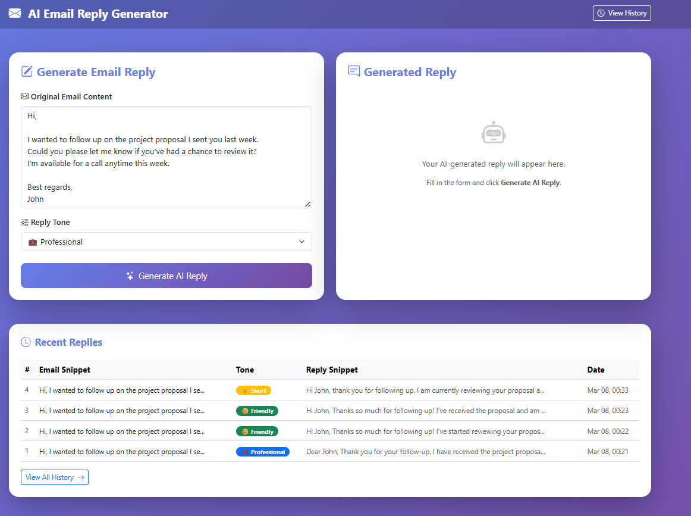
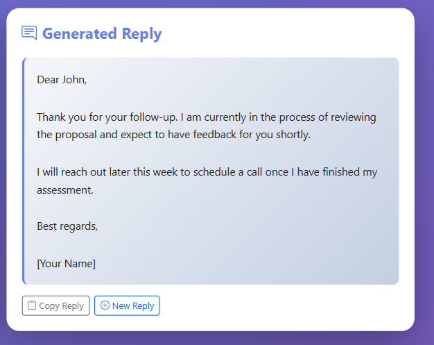

# AI Email Reply Generator

A web application I built using Spring Boot that automatically generates email replies using AI. You paste an email, choose a tone, and it gives you a ready-to-send reply.

## What it does

- Paste any email you received
- Choose a reply tone (Professional, Friendly, or Short)
- Click Generate — AI writes the reply for you
- All replies are saved to a MySQL database
- You can view your reply history anytime

## Tech Stack

- Java 17
- Spring Boot 3
- Spring Data JPA + Hibernate
- MySQL
- Thymeleaf (for the UI)
- Groq AI API (for generating replies)
- Maven
- Lombok
- Bootstrap 5

## Project Structure

```
src/main/java/com/aiemailreply/
├── controller/      → handles web requests and REST APIs
├── service/         → business logic and AI integration
├── repository/      → database operations
├── entity/          → database table mappings
├── dto/             → request and response objects
└── config/          → app configuration
```

## How to Run

**Requirements:**
- Java 17
- MySQL 8
- Maven
- Groq API key (free at console.groq.com)

**Steps:**

1. Clone the project
```bash
git clone https://github.com/vijayalaxmi168/ai-email-reply-generator.git
cd ai-email-reply-generator
```

2. Create the database
```sql
CREATE DATABASE email_reply_db;
```

3. Update `application.properties` with your details
```properties
spring.datasource.password=your_mysql_password
openai.api.key=your_groq_api_key
```

4. Run the app
```bash
mvn spring-boot:run
```

5. Open browser and go to `http://localhost:8080`

## API Endpoints

| Method | URL | Description |
|--------|-----|-------------|
| POST | /api/email-replies/generate | Generate a new reply |
| GET | /api/email-replies | Get all saved replies |
| GET | /api/email-replies/{id} | Get reply by ID |
| GET | /api/email-replies/tone/{tone} | Filter by tone |

## Database

Hibernate automatically creates the `email_replies` table with these columns:
- id, email_content, tone, generated_reply, created_at

## Screenshots
<div align="center">

**Home Page**



</div>

<br>

<div align="center">

**Generated Reply**



</div>

## What I learned building this

- How to integrate a third party AI API in Spring Boot
- Layered architecture with Controller, Service, Repository pattern
- JPA and Hibernate for database operations without writing SQL
- Thymeleaf for server side rendering
- REST API design and error handling

## Author

Vijayalaxmi Biradar 
GitHub: https://github.com/vijayalaxmi168

