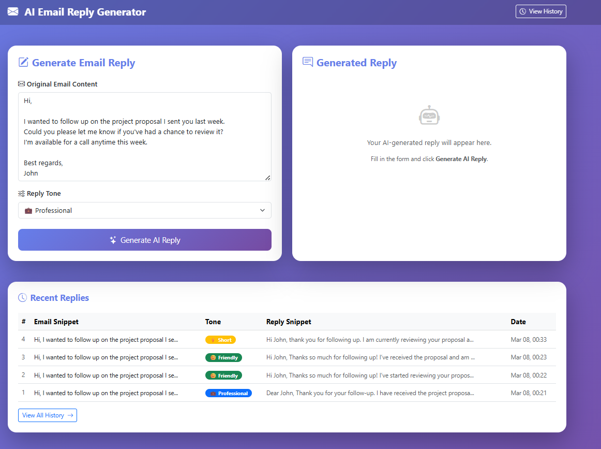
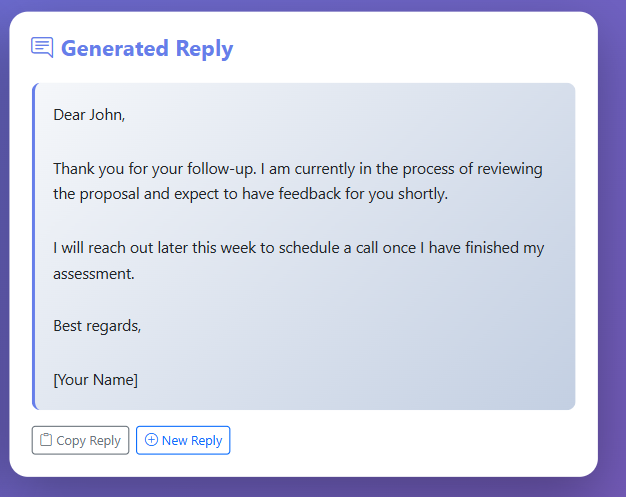

# AI Email Reply Generator

A Spring Boot web application that automatically generates professional email replies using Google Gemini AI. Paste an email, choose a tone, and get a ready-to-send reply instantly.

🚀 **Live Demo:** [Click here](http://ai-email-reply-generator-env.eba-h28mqqps.ap-south-1.elasticbeanstalk.com)
📁 **GitHub:** [vijayalaxmi168](https://github.com/vijayalaxmi168)

---

## What it does
- Paste any email you received
- Choose a reply tone (Professional, Friendly, or Short)
- Click Generate — Google Gemini AI writes the reply for you
- All replies are saved to MySQL database (AWS RDS in production)
- View your complete reply history anytime

---

## Tech Stack

| Category | Technology |
|----------|-----------|
| Language | Java 17 |
| Framework | Spring Boot 3 |
| Database | MySQL 8 (local), AWS RDS MySQL (production) |
| ORM | Spring Data JPA + Hibernate |
| Frontend | Thymeleaf + Bootstrap 5 |
| AI | Google Gemini AI API |
| Build | Maven + Lombok |
| Deployment | AWS Elastic Beanstalk |

---

## Deployment Architecture
GitHub → AWS Elastic Beanstalk (ap-south-1)
↓
Spring Boot App (port 5000)
↓
AWS RDS MySQL

**Spring profiles for environment separation:**
- `default` profile → local MySQL
- `aws` profile → AWS RDS MySQL

**Security:**
- API keys stored as AWS environment variables
- DB credentials stored as AWS environment variables
- No hardcoded credentials in code

---

## Project Structure
src/main/java/com/aiemailreply/
├── controller/      → handles web requests and REST APIs
├── service/         → business logic and AI integration
├── repository/      → database operations
├── entity/          → database table mappings
├── dto/             → request and response objects
└── config/          → app configuration
src/main/resources/
├── application.properties          → local config
└── application-aws.properties      → AWS production config
Procfile                            → AWS Elastic Beanstalk startup config

---

## How to Run Locally

**Requirements:**
- Java 17
- MySQL 8
- Maven
- Google Gemini API key (free at aistudio.google.com)

**Steps:**

**1. Clone the project**
```bash
git clone https://github.com/vijayalaxmi168/ai-email-reply-generator.git
cd ai-email-reply-generator
```

**2. Create the database**
```sql
CREATE DATABASE email_reply_db;
```

**3. Update application.properties**
```properties
spring.datasource.password=your_mysql_password
openai.api.key=your_gemini_api_key
openai.api.url=https://generativelanguage.googleapis.com/v1beta/models/gemini-2.5-flash:generateContent
```

**4. Run the app**
```bash
mvn spring-boot:run
```

**5. Open browser**
http://localhost:8080

---

## AWS Deployment

This project is deployed on AWS:

| Service | Purpose |
|---------|---------|
| AWS Elastic Beanstalk | Hosts Spring Boot application |
| AWS RDS MySQL | Cloud database for persistent storage |
| IAM Roles | Secure service access |
| Environment Variables | Secure credential management |
| Spring Profiles | Local vs production configuration |

---

## API Endpoints

| Method | URL | Description |
|--------|-----|-------------|
| POST | /generate | Generate new AI reply |
| GET | /history | View reply history |

---

## Database

Hibernate automatically creates the `email_replies` table:

| Column | Type | Description |
|--------|------|-------------|
| id | BIGINT | Primary key |
| email_content | TEXT | Original email |
| tone | VARCHAR | Reply tone selected |
| generated_reply | TEXT | AI generated reply |
| created_at | DATETIME | Timestamp |

---

## Screenshots

<div align="center">

**Home Page**



**Generated Reply**



</div>

---

## What I learned building this

- Integrating Google Gemini AI API with Spring Boot
- Layered architecture: Controller → Service → Repository
- JPA and Hibernate for database operations
- Thymeleaf for server-side rendering
- REST API design and error handling
- AWS Elastic Beanstalk deployment
- AWS RDS MySQL cloud database setup
- Spring profiles for environment separation
- Securing credentials with AWS environment variables
- Reading and debugging AWS deployment logs
- Procfile configuration for cloud deployment

---

## Author

**Vijayalaxmi Biradar**

- 📧 Email: vijayalaxmib0106@gmail.com
- 💼 LinkedIn: [vijaylaxmi-biradar-v24](https://linkedin.com/in/vijaylaxmi-biradar-v24)
- 🐙 GitHub: [vijayalaxmi168](https://github.com/vijayalaxmi168)
- 🌐 Portfolio: [vijayalaxmi06-portfolio.netlify.app](https://vijayalaxmi06-portfolio.netlify.app/)
